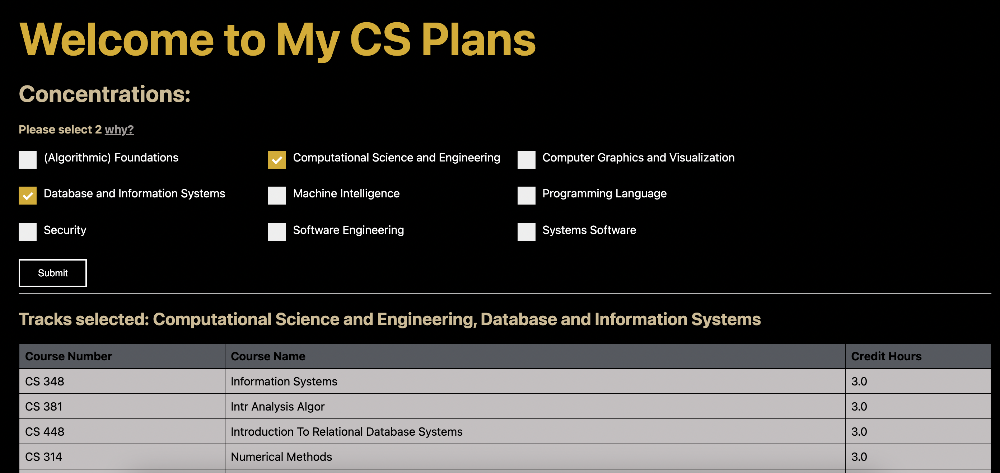

# My-CS-Plan
A web application built with Next.js and Flask that allows Purdue CS students to optimize the classes they take to complete multiple CS concentrations. 

## Table of Contents

- [My-CS-Plan](#my-cs-plan)
  - [Table of Contents](#table-of-contents)
  - [Setup](#setup)
    - [Clone the repository](#clone-the-repository)
    - [Install packages](#install-packages)
    - [Start the server](#start-the-server)
    - [Start the webpage](#start-the-webpage)
    - [Access the webpage](Access-the-webpage)
  - [Contributers](#contributers)
- Hackathon-specific information
  - [Inspiration](#inspiration) 
  - [What it does](#what-it-does)
  - [How we built it](#how-we-built-it)
  - [Challenges we ran into](#challenges-we-ran-into)
  - [Accomplishments that we're proud of](#accomplishments-that-were-proud-of)
  - [What we learned](#what-we-learned)
  - [What's next for My CS plan](#whats-next-for-my-cs-plan)

## Setup

There are docker availables inside of /website/ and /backend/ if you'd like to use those. The below instructions a manual install and launch. 

### Clone the repository
Navigate to where you'd like to clone the repository to, and then clone it
    
    cd [directory]
    git clone https://github.com/HelloWorldHackathon/My-CS-Plan.git

### Install packages
In terminal, inside your repository's folder, cd into website/
    
    cd website
    
Then install the dependencies:
   
    npm install 

### Start the server
In terminal, inside your repository's folder, cd into backend/ 

    cd .. 
    cd /backend
Then install the requirements

    pip install -r requirements.txt
Then start the server

    python3 -m flaskr.app   

### Start the webpage 
Next, create a new terminal tab. In that terminal tab, inside your repository's folder, cd into website/ 
    
    cd website
Then start the page
    
    npm run dev

### Access the webpage 
From there both the backend server and page are running! You can access the page at localhost with the provided port. Paste 
    
    localhost:3000
into your web browser.     

## Contributers 
<!-- ALL-CONTRIBUTORS-LIST:START - Do not remove or modify this section -->
<!-- prettier-ignore-start -->
<!-- markdownlint-disable -->
[Emoji key](https://allcontributors.org/docs/en/emoji-key) ✨
<table>
  <tr>
    <td align="center"><a href="https://github.com/Jaimss"> <b>James Harrell</b></a>  <a href="#ideas-Jaimss" title="Ideas & Planning">🤔</a>  <a href="#platform-Jaimss" title=IPackaging">📦</a> <a href="https://github.com/HelloWorldHackathon/My-CS-Plan/commits?author=Jaimss" title="Code">💻</a> </td>
      <td align="center"><a href="https://github.com/Jaimss"> <b>noam987</b></a>  <a href="#ideas-noam987" title="Ideas & Planning">🤔</a> <a href="https://github.com/HelloWorldHackathon/My-CS-Plan/commits?author=noam987" title="Code">💻</a> <a href="https://github.com/HelloWorldHackathon/My-CS-Plan/pulls?q=is%3Apr+reviewed-by%3Anoam987" title="Reviewed Pull Requests">👀</a> <a href="#maintenance-noam987" title="Maintenance">🚧</a> </td>
   <td align="center"><a href="https://github.com/JonathanOppenheimer"> <b>Jonathan Oppenheimer</b></a>  <a href="#ideas-JonathanOppenheimer" title="Ideas & Planning">🤔</a> <a title="Documentation">📖</a> <a href="https://github.com/HelloWorldHackathon/My-CS-Plan/commits?author=JonathanOppenheimer" title="Code">💻</a> <a href="https://github.com/HelloWorldHackathon/My-CS-Plan/pulls?q=is%3Apr+reviewed-by%3AJonathanOppenheimer" title="Reviewed Pull Requests">👀</a> <a href="#maintenance-JonathanOppenheimer" title="Maintenance">🚧</a> </td>
    <td align="center"><a href="https://github.com/thekammilian"> <b>thekammilianm</b></a>  <a href="#ideas-thekammilian" title="Ideas & Planning">🤔</a> <a href="#content-thekammilian" title="Content">🖋</a></td>
    <td align="center"><a href=https://github.com/DitrusNight"> <b>DitrusNight</b></a> <a href="https://github.com/HelloWorldHackathon/My-CS-Plan/commits?author=DitrusNight" title="Code">💻</a> <a href="https://github.com/HelloWorldHackathon/My-CS-Plan/pulls?q=is%3Apr+reviewed-by%3ADitrusNight" title="Reviewed Pull Requests">👀</a> <a href="#maintenance-DitrusNight" title="Maintenance">🚧</a></td> 
  </tr>
</table>
      
     

<!-- markdownlint-restore -->
<!-- prettier-ignore-end -->

<!-- ALL-CONTRIBUTORS-LIST:END -->

**The write up for the Hackathon is included below.** 

---
Our devpost is [available here](https://devpost.com/software/my-cs-plan). 

A presentation of the site is [available here](https://github.com/HelloWorldHackathon/My-CS-Plan/blob/readme/docs/HelloWorld_Hackathon_Presenatation.pptx). 

## Inspiration
The CS track system is VERY complicated. It can be frustrating trying to figure out what classes you need to take to finish two tracks. Some tracks have overlapping requirements, but most of the time, it is a list on the web that is tough to navigate. The two resources you can use are myPurduePlan which is notoriously outdated and slow, or an incredibly complicated spreadsheet posted by the CS Department 
## What it does
We have made a website that allows the user to select two of the CS tracks, and it will output a table with the minimum number of classes you need to take to fulfill to complete the two tracks. 
## How we built it
We used a next.js frontend that takes input from the checkboxes which then sends a get request to the python backend. The python backend then processes the classes selected and returns a minimum list of classes required for the student to complete the two tracks. 

That list of classes and their codes, names, and credit hours are formatted into a .json file which is then posted to the front-end.  The front-end formats the classes and their information into an HTML table string for a display.

## Challenges we ran into
- The track requirement list varies among different sources. 
- There were plenty of edge cases due to overlapping requirements. 
- We had issues posting from the backend. (HTTP requests with CORS are hard! Thank you Alwin!)
- Turning the JSON into an HTML table string

## Accomplishments that we're proud of
- Making it past the challenges listed above
- Creating a fully functional tool in less than 24 hours! 
- Making a full-on website accessible to anyone 

## What we learned
- How to make a full-on website (with frontend and backend connected) 
- How to make backend with python (flask) 
- How to connect the frontend to the backend 
- How hackathons work! 

## What's next for My CS plan
- Allowing more than 2 tracks to be selected 
- Ensuring data sources are accurate to be used by our algorithm 
